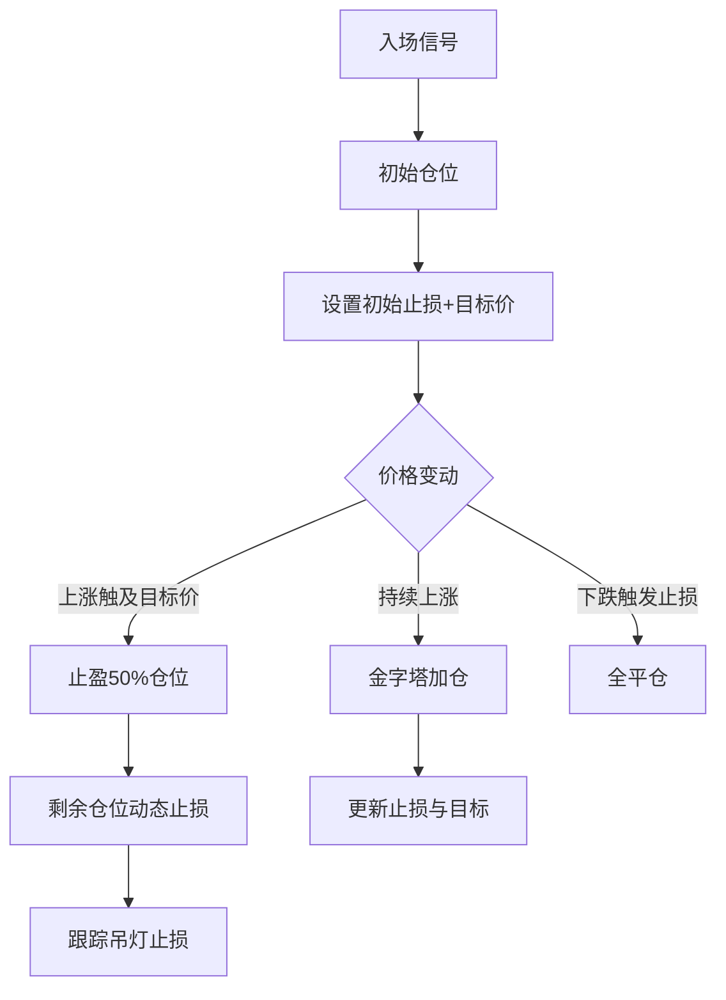

---

### **基于吊灯止损的多级风控交易策略完整说明**

---

#### **一、策略概述**
**目标**：通过动态止损、分批止盈及仓位管理，在趋势行情中最大化收益，在震荡行情中控制回撤。  
**核心理念**：  
1. **风险优先**：通过复合止损体系保护本金  
2. **趋势跟随**：利用吊灯止损捕捉趋势延续  
3. **灵活调仓**：结合加仓放大收益，减仓锁定利润  

**适用场景**：  
- 股票、期货、外汇等趋势性较强的品种  
- 日线或4小时级别趋势交易  
- 中高风险偏好的趋势跟踪策略  

---

#### **二、核心逻辑框架**


---

#### **三、参数配置表**
| 参数分类       | 参数名称                | 说明                          | 示例值     | 优化范围       |
|---------------|------------------------|-----------------------------|-----------|---------------|
| **止损模块**   | `initial_stop_type`    | 初始止损类型（ATR/固定比例）     | `atr`     | [atr, ratio]  |
|                | `initial_stop_value`   | 止损值（ATR倍数或百分比）        | `2`       | 1.5-3（ATR）  |
| **止盈模块**   | `target_type`          | 目标价类型（固定/ATR/前高）      | `atr`     | [fixed, atr]  |
|                | `first_exit_ratio`     | 首次止盈比例                   | `0.5`     | 0.3-0.7       |
| **仓位模块**   | `add_position_ratio`   | 加仓比例（相对初始仓位）          | `0.3`     | 0.2-0.5       |
|                | `max_add_times`        | 最大加仓次数                   | `2`       | 1-3           |
| **动态止损**   | `daily_lookback`       | 日线吊灯回溯周期                | `22`      | 14-30         |
|                | `hourly_lookback`      | 小时线吊灯回溯周期               | `8`       | 4-12          |

---

#### **四、入场与出场规则**
**1. 入场条件（需同时满足）**  
- 价格突破N日高点（N=20）  
- 5EMA上穿20EMA（均线金叉）  
- 成交量大于最近5日均值  

**2. 初始止损设置**  
```python
# 多头止损计算（示例）
atr_value = ATR(high, low, close, period=14)
initial_stop = entry_price - 2 * atr_value  # ATR倍数模式
# 或
initial_stop = entry_price * 0.95           # 固定比例模式
```

**3. 目标价设定（三选一）**  
| 类型          | 公式                              | 适用场景           |
|--------------|-----------------------------------|------------------|
| 固定比例      | entry_price × (1 + target_ratio)  | 明确盈利目标       |
| ATR倍数       | entry_price + 3×ATR              | 波动性市场        |
| 前高阻力      | 前30日最高价                      | 突破交易         |

**4. 加仓条件**  
- 价格创入场后新高  
- 加仓位置止损距离 ≥ 初始风险的50%  
- 当前波动率（ATR） < 初始ATR的1.5倍  

**5. 减仓规则**  
- 浮动盈利回撤30% → 减仓30%  
- 波动率突增50%（ATR变化率） → 减仓50%  
- 价格进入前高阻力区 → 减仓20%  

---

#### **五、动态止损体系**
**1. 混合时间框架止损**  
```python
def calculate_dynamic_stop():
    # 日线基准
    daily_high = max(last_22_days_high, current_day_high)
    daily_stop = daily_high - 3 * daily_atr
    
    # 小时线基准
    hourly_high = max(last_8_hours_high)
    hourly_stop = hourly_high - 2 * hourly_atr
    
    # 最终止损取两者最严格值
    return max(daily_stop, hourly_stop)
```

**2. 止损更新机制**  
| 时间条件        | 操作                          |
|----------------|------------------------------|
| 开盘时          | 使用昨日日线数据初始化          |
| 盘中每15分钟    | 更新当日最高价和小时线极值       |
| 价格创新高时    | 立即刷新所有止损位             |

---

#### **六、仓位管理模型**
**1. 头寸规模计算**  
```python
# 根据风险比例和止损距离计算
risk_per_trade = account_value * 0.01  # 1%风险
position_size = risk_per_trade / (entry_price - initial_stop)
```

**2. 金字塔加仓规则**  
| 加仓次数 | 加仓比例 | 累计仓位 | 止损收紧幅度 |
|---------|---------|---------|------------|
| 1       | 30%     | 1.3x    | ATR倍数-0.5 |
| 2       | 15%     | 1.45x   | ATR倍数-1.0 |

**3. 减仓保护规则**  
- 首次止盈后：剩余仓位止损上移至成本价  
- 加仓后：主仓位与加仓仓位独立止损  

---

#### **七、风险控制矩阵**
| 风险类型       | 监测指标                  | 应对措施                     |
|---------------|-------------------------|----------------------------|
| 趋势逆转       | 价格跌破动态止损            | 立即全平仓                   |
| 流动性风险     | 订单簿深度 < 日均量5%       | 停止加仓，启动被动减仓         |
| 过度波动       | 15分钟ATR > 日ATR50%      | 减仓50%并缩小止损间距         |
| 隔夜风险       | 收盘前1小时                | 启动隔夜保证金检查，超限则减仓 |

---

#### **八、代码实现（关键函数示例）**
**1. 动态止损更新**  
```python
def update_trailing_stop(strategy, new_high):
    # 混合时间框架计算
    daily_stop = new_high['daily'] - params.daily_multiplier * atr['daily']
    hourly_stop = new_high['hourly'] - params.hourly_multiplier * atr['hourly']
    
    # 选择更严格的止损
    final_stop = max(daily_stop, hourly_stop)
    
    # 跳空保护
    if final_stop < strategy.last_close * 0.98:
        final_stop = strategy.last_close * 0.98
        
    return final_stop
```

**2. 加仓管理**  
```python
def add_position_check(current_price, strategy):
    # 检查加仓条件
    cond1 = current_price > strategy.entry_price * 1.03
    cond2 = strategy.current_risk < initial_risk * 0.7
    cond3 = strategy.add_count < params.max_add_times
    
    if cond1 and cond2 and cond3:
        new_size = strategy.init_size * (params.add_ratio ** strategy.add_count)
        strategy.add_position(
            price=current_price,
            size=new_size,
            stop=current_price - 1.5 * atr_current
        )
```

---

#### **九、策略表现评估**
**1. 回测指标要求**  
| 指标            | 合格阈值   | 优秀阈值   |
|----------------|-----------|-----------|
| 年化收益率       | >15%      | >30%      |
| 最大回撤         | <20%      | <12%      |
| 盈亏比          | >1.5:1    | >2.5:1    |
| 胜率           | >40%      | >55%      |

**2. 参数优化建议**  
- **网格搜索范围**：  
  ```python
  param_grid = {
      'daily_lookback': [14, 22, 30],
      'hourly_multiplier': [1.8, 2.0, 2.2],
      'first_exit_ratio': [0.4, 0.5, 0.6]
  }
  ```
- **自适应优化**：  
  每季度重新优化参数，保留前20%参数组合运行  

---

#### **十、部署与监控**
**1. 系统架构**  


**2. 实时监控面板**  
- 核心指标：动态止损位、浮动盈亏、风险敞口  
- 预警功能：波动率突增、流动性下降、参数偏离  

---

#### **十一、策略升级方向**
1. **机器学习优化**  
   - 使用随机森林动态选择最佳参数组合  
   - LSTM预测最佳止损倍数  

2. **跨市场对冲**  
   - 在相关性>0.8的品种上建立反向保护头寸  

3. **期权融合**  
   - 用虚值期权构建止损保险策略  

---

**附录**：  
- [参数优化记录表模板]  
- [策略回测报告示例]  
- [风险事件应对手册]  

（注：实际部署需根据交易所API和合规要求调整，建议先在模拟盘运行完整周期验证稳定性）